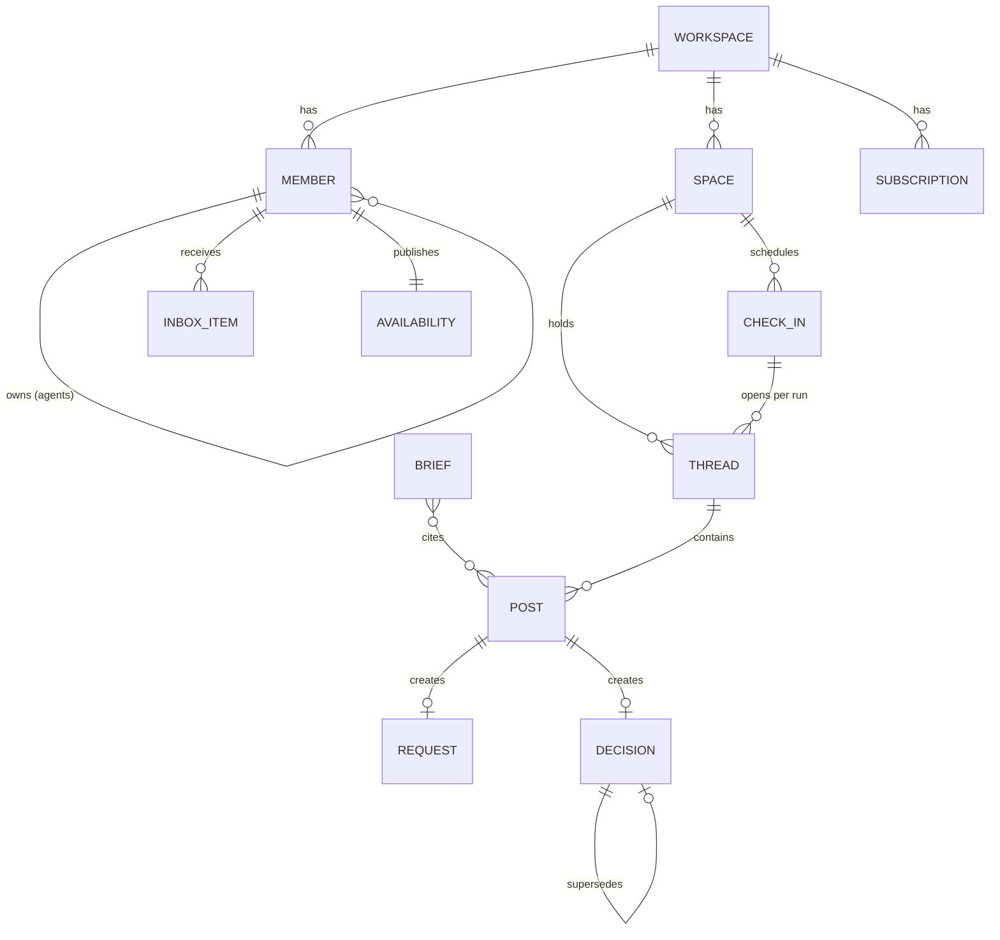

# Async Workspace API Specification

Draft v0.2, 8 October 2026. Author: Steve McDougall.

This is the HTTP API, MCP server and webhook contract for an async-first team communication platform, built for remote teams spread across timezones and for the AI agents that now work alongside them. It models work and attention. A real-time message stream exists only as a transport detail.

Stream-based chat breaks down for async teams because the stream is the product. Unread counts and presence dots reward whoever is online, decisions sink into scrollback, and requests have no owner or deadline. Adding agents to that model makes it worse, since they can produce more messages than any person can read.

> **This spec has been split into RFCs and ADRs.** It is kept as written,
> as the parent document, and each section below points at what replaced
> it. Where this spec and an accepted RFC or ADR disagree, the RFC or ADR
> is right. Names here are the placeholders used before the product was
> named Longhand (ADR 0002). See [the process](README.md),
> [the RFCs](rfc/README.md) and [the ADRs](adr/README.md).

## Contents

1. Design principles
2. Conventions
3. Domain model
4. Members, agents and permissions
5. Spaces and threads
6. Posts
7. Requests and decisions
8. Attention model
9. Briefs
10. Check-ins
11. Search
12. Events and webhooks
13. MCP server
14. Endpoint reference
15. Decisions taken and open questions

## 1. Design principles

> Carried into [RFC 0001](rfc/0001-longhand-v1.md), which sets v1's scope and principles.

1. **Every conversation has a purpose and an end.** Threads carry a title, an owner and a status, and resolving one records an outcome.
2. **Intent is structured data.** A post declares whether it is an FYI, a question, a request, an update or a decision. That field drives routing, delivery and summaries.
3. **The API protects attention.** Delivery follows the recipient's working hours and urgency rules. The inbox shows what needs you, ranked, with a reason attached.
4. **Agents are members.** They use the same identity, scope and audit model as people, are always labelled, and draft by default.
5. **Generated content cites its sources.** A brief item with no citation fails validation.
6. **One domain, three surfaces.** REST, MCP and webhooks all speak the same resources, scopes and event types. Nothing is possible through one surface that the permission model forbids through another.
7. **Standard plumbing.** URL versioning, RFC 9457 problem details, idempotency keys, cursor pagination, CloudEvents, Standard Webhooks signing, and the MCP authorisation spec.

Out of scope for v1: voice and video calls, file storage beyond attachments, and federation between workspaces. Each can be added later without changing the core resources.

## 2. Conventions

> Superseded by [RFC 0002](rfc/0002-api-conventions-and-errors.md): the API is JSON:API 1.1, and errors are JSON:API error objects rather than RFC 9457.

Every endpoint follows the same rules, so a client written against one resource works against the rest.

| Concern | Rule |
| --- | --- |
| Base URL | `https://api.example.dev/v1`. The major version is in the path and only changes on breaking changes |
| Format | JSON request and response bodies. Fields are `snake_case` |
| Envelope | Single resources return `{ "data": {...} }`. Collections return `{ "data": [...], "meta": { "next_cursor": "..." } }` |
| Identifiers | Prefixed ULIDs, sortable by creation time: `wsp_`, `mem_`, `spc_`, `thr_`, `pst_`, `req_`, `dec_`, `inb_`, `brf_`, `chk_`, `run_`, `sub_`, `evt_`, `upl_` |
| Timestamps | RFC 3339 in UTC, e.g. `2026-10-08T11:40:00Z`. Durations are ISO 8601, e.g. `PT24H` |
| Authentication | OAuth 2.1 bearer tokens. A token is bound to one workspace, so workspace IDs never appear in URLs |
| Authorisation | Scopes of the form `resource:action`, e.g. `threads:read`. See section 4 |
| Pagination | Cursor based. `?limit=` (default 50, max 200) and `?cursor=`. A `Link` header with `rel="next"` is also returned |
| Filtering | Plain query parameters, comma separated for multiple values: `?status=open,waiting` |
| Idempotency | Every `POST` accepts an `Idempotency-Key` header. Keys are kept for 24 hours and a replay returns the original response |
| Concurrency | Mutable resources return an `ETag`. `PATCH` accepts `If-Match` and returns `412` on a mismatch |
| Long-running work | `202 Accepted` with a `Location` header to poll, plus an event when it completes |
| Rate limits | `RateLimit-Policy` and `RateLimit` headers. `429` responses include `Retry-After` |
| Errors | RFC 9457 problem details, `Content-Type: application/problem+json`. Generic problem `type` URLs point at the apiguide.dev errors catalogue |
| Deprecation | `Deprecation` and `Sunset` headers on affected endpoints, with a `Link` to the migration guide |

### Errors

Every error is an RFC 9457 problem details object, and every `type` is a URL that resolves to documentation a developer can open.

- **Generic HTTP problems use the [apiguide.dev errors catalogue](https://apiguide.dev/errors/) as their `type`.** Validation, auth, scope, not-found, conflicts, preconditions, idempotency, rate limits and server errors are the same in every API, so the `type` URL points straight at the apiguide.dev page that explains the error, its causes and how to fix it. The API does not maintain its own copy of that documentation.
- **Problems specific to this product use `https://api.example.dev/problems/{slug}`.** These cover rules that only exist here, such as agent approvals or citation checks. Each documentation page links to the closest apiguide.dev entry for the general HTTP behaviour.
- `type` URLs are permanent. A problem type is never renamed, only added or deprecated.
- `instance` is the request path, and every problem response carries the request's `X-Request-Id` for support.

Validation failures use the field-keyed `errors` map from the [apiguide.dev validation schema](https://apiguide.dev/errors/validation-failed/), which is also Laravel's native shape:

```json
{
  "type": "https://apiguide.dev/errors/validation-failed",
  "title": "Validation Failed",
  "status": 422,
  "detail": "The request body has 2 invalid fields.",
  "errors": {
    "request.due_by": ["The due by date must be in the future."],
    "request.assignee": ["The assignee must be a member of this space."]
  },
  "instance": "/v1/threads/thr_01JA9X.../posts"
}
```

A product-specific problem adds extension members where the client needs them to recover:

```json
{
  "type": "https://api.example.dev/problems/approval-required",
  "title": "Approval Required",
  "status": 403,
  "detail": "Triage needs approval from its owner to assign requests.",
  "draft": { "type": "request", "id": "req_01JAA4..." },
  "approver": "mem_01JA7Q...",
  "instance": "/v1/threads/thr_01JAA1.../posts"
}
```

#### Generic problems, documented on apiguide.dev

| `type` | Status | When |
| --- | --- | --- |
| [`https://apiguide.dev/errors/malformed-request-body`](https://apiguide.dev/errors/malformed-request-body/) | 400 | The body is not valid JSON |
| [`https://apiguide.dev/errors/invalid-pagination-cursor`](https://apiguide.dev/errors/invalid-pagination-cursor/) | 400 | `cursor` is unknown, expired or from another query |
| [`https://apiguide.dev/errors/unauthorized`](https://apiguide.dev/errors/unauthorized/) | 401 | No token, or an invalid one |
| [`https://apiguide.dev/errors/expired-authentication-token`](https://apiguide.dev/errors/expired-authentication-token/) | 401 | The token, stream ticket or stream cookie has expired |
| [`https://apiguide.dev/errors/insufficient-scope`](https://apiguide.dev/errors/insufficient-scope/) | 403 | The token lacks a required scope. The response also sets `WWW-Authenticate` with the missing `scope`, per RFC 6750 |
| [`https://apiguide.dev/errors/resource-not-found`](https://apiguide.dev/errors/resource-not-found/) | 404 | The resource does not exist or the token cannot see it |
| [`https://apiguide.dev/errors/method-not-allowed`](https://apiguide.dev/errors/method-not-allowed/) | 405 | The method is not supported on this path |
| [`https://apiguide.dev/errors/not-acceptable`](https://apiguide.dev/errors/not-acceptable/) | 406 | `Accept` asks for something other than JSON or an event stream |
| [`https://apiguide.dev/errors/idempotency-key-conflict`](https://apiguide.dev/errors/idempotency-key-conflict/) | 409 | The same `Idempotency-Key` was reused with a different body |
| [`https://apiguide.dev/errors/resource-conflict`](https://apiguide.dev/errors/resource-conflict/) | 409 | A uniqueness clash, such as a duplicate handle |
| [`https://apiguide.dev/errors/precondition-failed`](https://apiguide.dev/errors/precondition-failed/) | 412 | `If-Match` did not match the current `ETag` |
| [`https://apiguide.dev/errors/payload-too-large`](https://apiguide.dev/errors/payload-too-large/) | 413 | A post body or upload is over the limit |
| [`https://apiguide.dev/errors/unsupported-media-type`](https://apiguide.dev/errors/unsupported-media-type/) | 415 | The body is not `application/json` |
| [`https://apiguide.dev/errors/validation-failed`](https://apiguide.dev/errors/validation-failed/) | 422 | Body fields failed validation |
| [`https://apiguide.dev/errors/unprocessable-query`](https://apiguide.dev/errors/unprocessable-query/) | 422 | Query parameters or filters are invalid |
| [`https://apiguide.dev/errors/rate-limit-exceeded`](https://apiguide.dev/errors/rate-limit-exceeded/) | 429 | Too many requests, or too many `incident` sends. Includes `Retry-After` |
| [`https://apiguide.dev/errors/internal-server-error`](https://apiguide.dev/errors/internal-server-error/) | 500 | An unexpected failure |
| [`https://apiguide.dev/errors/service-unavailable`](https://apiguide.dev/errors/service-unavailable/) | 503 | Maintenance or overload. Includes `Retry-After` |

#### Product-specific problems

| `type` slug | Status | When | Extension members | Links to |
| --- | --- | --- | --- | --- |
| `approval-required` | 403 | An agent attempted an action its owner must approve. A draft was created instead | `draft`, `approver` | [Insufficient Scope](https://apiguide.dev/errors/insufficient-scope/) |
| `invalid-transition` | 409 | A state change not allowed from the current state, such as completing a declined request | `current_state`, `allowed`, `blocking` (for example the open requests stopping a thread resolving) | [Resource Conflict](https://apiguide.dev/errors/resource-conflict/) |
| `uncited-content` | 422 | A brief item has no citation, or cites something outside the scope or the reader's visibility | `items` (the indexes that failed) | [Validation Failed](https://apiguide.dev/errors/validation-failed/) |
| `decision-immutable` | 409 | An attempt to edit a published decision instead of superseding it | `decision` | [Resource Conflict](https://apiguide.dev/errors/resource-conflict/) |
| `incident-only` | 422 | `incident` urgency used outside an incident thread | `thread_purpose` | [Validation Failed](https://apiguide.dev/errors/validation-failed/) |

## 3. Domain model

> Carried into [RFC 0001](rfc/0001-longhand-v1.md), with each resource defined by the RFC that owns it.



| Resource | Replaces | Purpose |
| --- | --- | --- |
| `Member` | User and bot accounts | Human or agent, with timezone, working hours and response expectations |
| `Space` | Channel and DM | A team, project or private group. Holds threads, never loose messages |
| `Thread` | Channel scroll and reply threads | Titled conversation with an owner and a status |
| `Post` | Message | Content with an `intent` |
| `Request` | "Can someone...?" | An ask with one assignee, a due date and a state |
| `Decision` | Pinned messages | Immutable record of what was decided, by whom, and why |
| `InboxItem` | Unread badges and mentions | Something that needs a specific member to act |
| `Availability` | Presence dot | When a member works and what may interrupt them |
| `Brief` | Scrolling back | Generated catch-up with citations |
| `CheckIn` | Standups | Recurring async prompts with collected answers |
| `Subscription` | Event API | A webhook destination for events |

## 4. Members, agents and permissions

> Superseded by [RFC 0003](rfc/0003-identity.md), which adds onboarding, accounts and workspaces.

People and agents are both `Member` resources with a `type` of `human` or `agent`. They share one permission model, and the server stamps `type` on everything a member authors, so a client cannot pass an agent's post off as a person's.

### Member

```json
{
  "id": "mem_01JA7Q...",
  "type": "human",
  "display_name": "Steve McDougall",
  "handle": "steve",
  "role": "admin",
  "timezone": "Europe/London",
  "availability": { "in_window": false, "next_window_starts_at": "2026-10-09T08:30:00Z" },
  "created_at": "2026-01-12T09:00:00Z"
}
```

Roles are `owner`, `admin`, `member` and `guest`. Guests only see spaces they are explicitly added to.

### Agents

An agent has an owning human and an explicit set of scopes and approval rules.

```json
{
  "id": "mem_01JA8T...",
  "type": "agent",
  "display_name": "Triage",
  "owner": "mem_01JA7Q...",
  "description": "Routes new support threads and drafts first replies",
  "scopes": ["threads:read", "posts:write:draft", "requests:write"],
  "requires_approval_for": ["posts:publish", "requests:assign"],
  "spaces": ["spc_01JA9S..."],
  "acts_on_behalf_of": null,
  "model": { "provider": "anthropic", "name": "claude-sonnet-5-5" },
  "status": "active"
}
```

The rules the API enforces:

- **Draft by default.** `posts:write:draft` creates posts with `status: draft`. A human with access to the thread publishes them through `POST /v1/posts/{post}/publish`, or discards them. Granting `posts:write` lets an agent publish directly, and that grant is written to the audit log.
- **Approval rules return a draft.** When an agent hits an action listed in `requires_approval_for`, the API creates the pending object, returns `403 approval-required` with a link to it, and adds a `draft_awaiting_approval` inbox item for the owner.
- **Space allow-list.** An agent only sees the spaces in its `spaces` list, even when the workspace token could see more.
- **Delegation is explicit.** When `acts_on_behalf_of` is set, every action shows as "Triage for Steve" in clients and in the audit log. Only the named human can set it.
- **Owners are accountable.** Deactivating a human owner suspends their agents until ownership is reassigned.
- **Decisions stay human.** Agents can draft decisions but never publish them, whatever their scopes.

Agents are created with `POST /v1/agents` and managed under `/v1/agents/{member}`. They connect through REST with a client-credentials token, or through the MCP server (section 13).

### Scopes

| Scope | Grants |
| --- | --- |
| `spaces:read` / `spaces:write` | List, read, create and update spaces |
| `threads:read` / `threads:write` | Read threads, create them, change status and owner |
| `posts:write:draft` | Create draft posts only |
| `posts:write` | Create and publish posts |
| `requests:write` | Create, accept, complete and decline requests |
| `requests:assign` | Assign or reassign requests to other members |
| `decisions:write` | Record decisions (humans only for publishing) |
| `inbox:read` / `inbox:write` | Read and act on the token holder's own inbox |
| `briefs:write` | Generate briefs, or write them as a brief generator |
| `check_ins:write` | Create check-ins and submit responses |
| `members:read` / `members:write` | Read members, manage members and agents |
| `webhooks:write` | Manage webhook subscriptions |
| `audit:read` | Read the workspace audit log |

### Audit log

`GET /v1/audit-events` returns every state change with the actor, the actor type, any `acts_on_behalf_of`, the scope used, the surface (`rest`, `mcp`) and the token ID. It is append-only and requires `audit:read`.

## 5. Spaces and threads

> Superseded by [RFC 0004](rfc/0004-spaces-threads-and-posts.md).

A space holds threads, and a thread holds posts. There is no way to post into a space without a thread, which is the single biggest difference from channel-based chat.

### Space

```json
{
  "id": "spc_01JA9S...",
  "kind": "team",
  "name": "Billing",
  "description": "Billing service and invoicing",
  "visibility": "workspace",
  "default_urgency": "today",
  "max_urgency": "now",
  "stale_after": "P7D",
  "member_count": 6,
  "created_at": "2026-02-03T10:00:00Z"
}
```

`kind` is one of:

- `team` for an ongoing group or function.
- `project` for time-boxed work. Project spaces accept an `ends_at` and archive themselves once it passes and every thread is resolved.
- `direct` for private conversations between two and eight members. They have no name and are found by membership through `POST /v1/spaces/direct` with a list of members. If one already exists for that exact set, it is returned.

Direct messages still use titled threads. Otherwise DMs become a second untracked stream and the whole model leaks.

### Thread

```json
{
  "id": "thr_01JA9X...",
  "space": "spc_01JA9S...",
  "title": "Pick a queue driver for the billing service",
  "purpose": "decision",
  "status": "open",
  "owner": "mem_01JA7Q...",
  "participants": ["mem_01JA7Q...", "mem_01JA7R..."],
  "decide_by": "2026-10-15T17:00:00Z",
  "waiting_on": null,
  "outcome": null,
  "related_threads": [],
  "last_activity_at": "2026-10-08T11:40:00Z",
  "counts": { "posts": 12, "open_requests": 1 },
  "created_at": "2026-10-06T09:12:00Z"
}
```

`purpose` is `discussion`, `decision`, `request`, `announcement` or `incident`. It sets defaults: a `decision` thread requires a decision on resolution, an `announcement` thread only lets the owner post top-level updates, and an `incident` thread may use the `incident` urgency tier.

Creating a thread requires a title and a first post:

```http
POST /v1/spaces/spc_01JA9S.../threads
Idempotency-Key: 4f1c...

{
  "title": "Pick a queue driver for the billing service",
  "purpose": "decision",
  "decide_by": "2026-10-15T17:00:00Z",
  "participants": ["mem_01JA7R..."],
  "post": {
    "intent": "question",
    "body": { "format": "markdown", "text": "Redis or SQS? Constraints are in the ADR." }
  }
}
```

Every thread has exactly one `owner`. The creator owns it unless another member is named, and ownership moves with `PATCH`. The owner is the person nudged when a thread goes stale.

### Lifecycle

| Status | Meaning | Moves to |
| --- | --- | --- |
| `open` | Active discussion | `waiting`, `resolved`, `archived` |
| `waiting` | Blocked on a member or a date, set in `waiting_on` | `open`, `resolved` |
| `resolved` | Finished, with an `outcome` | `open` (reopen), `archived` |
| `archived` | Read-only | `open` (owner or admin only) |

Resolving is its own endpoint because it carries data:

```http
POST /v1/threads/thr_01JA9X.../resolve

{
  "outcome": "Going with SQS. Redis persistence risk is not worth it for billing.",
  "decision": {
    "summary": "Use SQS for the billing queue",
    "decided_by": ["mem_01JA7Q..."]
  }
}
```

`outcome` is always required. `decision` is required when `purpose` is `decision`. Open requests in the thread must be completed, declined or moved first, or the call returns `409 invalid-transition` listing them.

### Staleness

A thread with status `open` and no activity for its space's `stale_after` duration emits `thread.stale` and adds an inbox item for the owner. Nothing happens to the thread itself. The owner, or an agent subscribed to the event, decides whether to nudge, resolve or archive it. `waiting` threads are never stale until their `waiting_on.until` date passes.

## 6. Posts

> Superseded by [RFC 0004](rfc/0004-spaces-threads-and-posts.md).

A post is a single contribution to a thread, and its `intent` decides how the rest of the system treats it. Posts are flat inside a thread. Anything that needs its own sub-conversation becomes a new thread linked through `related_threads`.

```json
{
  "id": "pst_01JAA2...",
  "thread": "thr_01JA9X...",
  "author": { "id": "mem_01JA7Q...", "type": "human", "acts_on_behalf_of": null },
  "intent": "question",
  "status": "published",
  "body": { "format": "markdown", "text": "Redis or SQS? Constraints are in the ADR." },
  "mentions": ["mem_01JA7R..."],
  "attachments": [
    { "type": "link", "url": "https://github.com/...", "title": "ADR 014" }
  ],
  "urgency": "today",
  "reply_to": null,
  "reactions": [{ "emoji": "eyes", "count": 2, "me": false }],
  "edited_at": null,
  "created_at": "2026-10-08T11:40:00Z"
}
```

### Intents

| Intent | Use for | Effect |
| --- | --- | --- |
| `fyi` | Context nobody needs to act on | Never creates inbox items. Appears in briefs when relevant to the reader |
| `question` | Something that needs an answer | Inbox item for mentioned members. Tracked as unanswered until a reply references it with `reply_to`, or the asker marks it answered |
| `request` | An ask with an owner and deadline | Must include a `request` object, which creates a `Request` |
| `update` | Progress on the thread's work | Feeds briefs and check-ins. Inbox item only for the thread owner |
| `decision` | Announcing a decision | Must include a `decision` object, which creates a `Decision` |

Intent defaults to `fyi`. Clients should offer intent as a lightweight choice, and agents can suggest a different intent on a draft for the author to accept.

### Writing posts

`POST /v1/threads/{thread}/posts` creates a post. `urgency` defaults to the space's `default_urgency`, is capped by its `max_urgency`, and is checked against each recipient's rules (section 8). The response always includes a `delivery` summary so the sender knows what will happen:

```json
"delivery": [
  { "member": "mem_01JA7R...", "tier": "today", "deliver_at": "2026-10-09T08:30:00Z", "reason": "outside_working_hours" }
]
```

### Editing and deletion

- Authors edit with `PATCH /v1/posts/{post}`. Edits after 15 minutes keep a revision history at `GET /v1/posts/{post}/revisions`, and readers see an edited marker.
- `intent` can change while a post is a draft. After publishing, changing to or from `request` or `decision` is refused, because those created other resources.
- `DELETE /v1/posts/{post}` replaces the body with a tombstone and keeps the ID, so citations in briefs and decisions still resolve.

### Drafts

A draft is visible to its author and, when the author is an agent, to the agent's owner and anyone with `threads:write` on the thread. `POST /v1/posts/{post}/publish` publishes it, optionally with edits. `DELETE` on a draft removes it entirely.

### Attachments and reactions

Attachments are `link` or `file`. Files are uploaded first with `POST /v1/uploads`, which returns a short-lived upload URL and an `upl_` ID to reference. Reactions use `PUT` and `DELETE` on `/v1/posts/{post}/reactions/{emoji}` and never create inbox items.

## 7. Requests and decisions

> Superseded by [RFC 0005](rfc/0005-requests-and-decisions.md).

Requests and decisions are the two things async teams lose most often in chat. Both are created through a post, so they always have context, and both live on as their own resources.

### Request

Created by a post with `intent: request`:

```json
{
  "intent": "request",
  "body": { "format": "markdown", "text": "Can you review the webhook retry spec?" },
  "request": {
    "assignee": "mem_01JA7R...",
    "due_by": "2026-10-10T12:00:00Z",
    "urgency": "today",
    "done_when": "Comments on the spec or a thumbs up in this thread"
  }
}
```

The resulting resource:

```json
{
  "id": "req_01JAA4...",
  "post": "pst_01JAA3...",
  "thread": "thr_01JAA1...",
  "requester": "mem_01JA7Q...",
  "assignee": "mem_01JA7R...",
  "state": "pending",
  "due_by": "2026-10-10T12:00:00Z",
  "done_when": "Comments on the spec or a thumbs up in this thread",
  "lands_at": "2026-10-09T08:30:00Z",
  "history": [{ "state": "pending", "at": "2026-10-08T11:42:00Z", "by": "mem_01JA7Q..." }]
}
```

`lands_at` tells the requester when the assignee will actually see it. A request has one assignee. Asking several people means several requests, which keeps ownership honest.

| From | Action | To | Who |
| --- | --- | --- | --- |
| `pending` | `POST /accept` | `accepted` | Assignee |
| `pending` | `POST /decline` with `reason` | `declined` | Assignee |
| `pending`, `accepted` | `POST /reassign` with `assignee` | `pending` | Assignee or requester |
| `accepted` | `POST /complete` with optional `note` | `done` | Assignee |
| `pending`, `accepted` | `POST /cancel` | `cancelled` | Requester |
| `declined`, `done` | `POST /reopen` | `pending` | Requester |

If `due_by` passes while the request is `pending` or `accepted`, `request.overdue` fires and both people get an inbox item. The state does not change, because overdue is a fact about time rather than progress.

`GET /v1/me/requests?role=assignee&state=pending,accepted` gives a person their outstanding work across every space. `role=requester` gives what they are waiting on.

### Decision

Created by a post with `intent: decision`, or when resolving a thread.

```json
{
  "id": "dec_01JAB0...",
  "thread": "thr_01JA9X...",
  "post": "pst_01JAAZ...",
  "summary": "Use SQS for the billing queue",
  "rationale": "Redis persistence risk is not worth it for billing.",
  "decided_by": ["mem_01JA7Q..."],
  "informed": ["spc_01JA9S..."],
  "status": "active",
  "supersedes": null,
  "superseded_by": null,
  "tags": ["infrastructure", "billing"],
  "decided_at": "2026-10-08T15:00:00Z"
}
```

Decisions are immutable apart from `tags`. Reversing one means recording a new decision with `supersedes` set. The superseding decision must come from a post in some thread, and the API adds a linking `fyi` post to the original thread so anyone reading the old discussion finds the new answer. The original's `status` becomes `superseded`.

Only members in the original `decided_by`, or admins, can supersede a decision.

### Decision log

`GET /v1/decisions` lists decisions across the workspace, filterable by `space`, `tag`, `status`, `decided_by` and `decided_after`. `GET /v1/decisions/{decision}/chain` returns the full supersession chain in order. The log is the main reason teams will keep using this over chat, so it gets its own endpoint.

## 8. Attention model

> Superseded by [RFC 0006](rfc/0006-the-attention-model.md).

The sender chooses how urgent something is, the recipient decides what urgency may interrupt them, and the server enforces the recipient's rules. That split is what makes the platform async.

### Availability

Every member publishes availability, set by hand or managed by a calendar integration.

```http
PUT /v1/me/availability

{
  "timezone": "Europe/London",
  "working_hours": [
    { "days": ["mon", "tue", "wed", "thu"], "start": "09:30", "end": "16:00" }
  ],
  "away": [
    { "from": "2026-10-20", "until": "2026-10-24", "note": "Conference", "delegate": "mem_01JA7R..." }
  ],
  "response_expectation": "PT24H",
  "focus_blocks": [
    { "days": ["tue", "thu"], "start": "09:30", "end": "12:00" }
  ],
  "delivery": {
    "today_batches": ["09:30", "14:00"],
    "digest": { "schedule": "0 9 * * 1-5", "channel": "email" },
    "interrupt_for": ["incident"]
  }
}
```

`response_expectation` is shown to anyone sending to this member, so the norm is visible instead of assumed. During an `away` period with a `delegate`, new requests suggest the delegate as a reassignment. Nothing is reassigned automatically.

Other members see a reduced view through `GET /v1/members/{member}/availability`: timezone, whether they are in a working window, when the next one starts, any away note, and the response expectation. Exact hours and focus blocks stay private.

### Urgency tiers

| Tier | Delivery | Limits |
| --- | --- | --- |
| `incident` | Immediately, including outside working hours and focus blocks, if the recipient lists it in `interrupt_for` | Only in threads with `purpose: incident`. Rate limited per sender and always audited |
| `now` | Immediately inside working hours and outside focus blocks. Otherwise at the next window start | Counted per sender in workspace analytics |
| `today` | At the recipient's next `today_batches` time | None |
| `digest` | Only in the scheduled digest and in briefs | None |

### Delivery rules

For each recipient of a post, request or mention, the server works out one `deliver_at`:

1. Start from the sender's tier, capped by the space's `max_urgency`.
2. If the tier is `incident` and the recipient allows it, deliver now.
3. If the recipient is away, hold until they return.
4. For `now`, deliver now if inside a working window and outside a focus block, otherwise at the next window start.
5. For `today`, deliver at the next batch time inside a working window.
6. For `digest`, attach to the next digest and send no push notification.

Sending outside someone's hours is never an error. The API returns `201` with the computed `delivery` array and the client shows it, e.g. "lands in their inbox at 09:30 their time". Senders who genuinely need to break through use an incident thread.

### Inbox

The inbox replaces unread counts and mention badges. It holds only items that need the member to do something.

```json
{
  "id": "inb_01JAB5...",
  "tier": "today",
  "reason": "request_assigned",
  "subject": { "type": "request", "id": "req_01JAA4..." },
  "thread": { "id": "thr_01JAA1...", "title": "Webhook retry spec" },
  "from": { "id": "mem_01JA7Q...", "type": "human" },
  "due_by": "2026-10-10T12:00:00Z",
  "delivered_at": "2026-10-09T08:30:00Z",
  "state": "open",
  "snoozed_until": null
}
```

Reasons: `request_assigned`, `request_overdue`, `request_completed`, `request_declined`, `question_asked`, `mentioned`, `decision_needed`, `draft_awaiting_approval`, `thread_stale`, `thread_reopened`, `check_in_due`, `brief_flagged`, `webhook_disabled`.

- `GET /v1/me/inbox` returns delivered items only, ordered by tier, then due date, then delivery time. Filter with `?tier=`, `?reason=` and `?state=`.
- `POST /v1/me/inbox/{item}/done`, `/snooze` with `until`, and `/reopen` change state. Completing the underlying request or answering the question closes the item automatically.
- `POST /v1/me/inbox/bulk` accepts up to 100 item IDs and one action.

Posts have no read or unread state. Clients track a per-thread `last_seen_post` with `PUT /v1/threads/{thread}/cursor`, which briefs use for "since last seen".

## 9. Briefs

> Superseded by [RFC 0007](rfc/0007-briefs.md).

A brief is a generated catch-up for one reader over a defined scope. It is structured data with citations on every item, so a client can link each line back to the posts it came from and the reader can check anything that looks wrong.

### Requesting a brief

```http
POST /v1/briefs
Idempotency-Key: 9b2e...

{
  "scope": { "type": "member", "since": "last_seen" },
  "focus": ["decisions", "requests_for_me", "blocked"],
  "length": "short"
}

HTTP/1.1 202 Accepted
Location: /v1/briefs/brf_01JABC...
```

| Scope type | Covers | Extra fields |
| --- | --- | --- |
| `member` | Everything the reader can see across their spaces | `since` as a timestamp or `last_seen` |
| `space` | One space | `space`, `since` |
| `thread` | One thread, start to now | `thread` |
| `decisions` | The decision log for a period | `space` optional, `since` |

`focus` narrows the brief to any of `decisions`, `requests_for_me`, `requests_from_me`, `blocked`, `questions_unanswered`, `updates` and `mentions`. Omitting it includes all of them. `length` is `short`, `standard` or `full`.

A brief only draws on content the reader can already see. The scope is evaluated with the reader's permissions, never the generating agent's.

### The result

```json
{
  "id": "brf_01JABC...",
  "status": "ready",
  "reader": "mem_01JA7Q...",
  "scope": { "type": "member", "since": "2026-10-07T16:00:00Z" },
  "sections": [
    {
      "kind": "decisions",
      "heading": "Decided while you were away",
      "items": [
        {
          "text": "Billing queue moves to SQS.",
          "citations": [
            { "type": "decision", "id": "dec_01JAB0..." },
            { "type": "post", "id": "pst_01JAAZ..." }
          ]
        }
      ]
    }
  ],
  "generated_by": "mem_01JA8B...",
  "model": { "provider": "anthropic", "name": "claude-sonnet-5-5" },
  "source_window": { "from": "2026-10-07T16:00:00Z", "to": "2026-10-08T11:40:00Z" },
  "stale": false,
  "created_at": "2026-10-08T11:41:12Z"
}
```

`status` moves through `queued`, `generating`, then `ready` or `failed`.

### Citation rules

- Every item must have at least one citation, whoever generated the brief. Uncited items are rejected with `422 uncited-content`.
- Every cited ID must exist, sit inside the brief's scope and be visible to the reader. Anything else is rejected the same way.
- If a cited post is later edited or deleted, the brief is marked `stale: true` rather than silently changing.

### Bring your own generator

The built-in brief agent is a workspace member like any other. A team can replace it with their own agent: it subscribes to `brief.requested`, reads the scope through the API or MCP, and writes the result with `PUT /v1/briefs/{brief}` using the same schema and validation. The workspace picks the model and pays for it.

### Feedback

`POST /v1/briefs/{brief}/items/{index}/feedback` with `accurate`, `inaccurate` or `missing_context` and an optional note. An `inaccurate` flag puts a `brief_flagged` inbox item in front of the generating agent's owner.

## 10. Check-ins

> Superseded by [RFC 0008](rfc/0008-check-ins.md).

Check-ins replace standups and status meetings with a recurring prompt each member answers in their own working hours. Each run produces a thread, so responses stay discussable and briefs can cite them.

```http
POST /v1/spaces/spc_01JA9S.../check-ins

{
  "name": "Weekly billing update",
  "schedule": "0 10 * * 1",
  "schedule_timezone": "recipient",
  "respondents": ["mem_01JA7Q...", "mem_01JA7R..."],
  "questions": [
    { "id": "done", "prompt": "What did you ship last week?", "intent": "update" },
    { "id": "next", "prompt": "What are you working on this week?", "intent": "update" },
    { "id": "blocked", "prompt": "Anything blocking you?", "intent": "question", "optional": true }
  ],
  "close_after": "P2D",
  "summary": { "enabled": true, "post_to_thread": true }
}
```

- `schedule_timezone: recipient` sends each person the prompt at that local time. `space` uses one shared time.
- Each run creates a thread with `purpose: discussion` and a `check_in_due` inbox item per respondent.
- `POST /v1/check-ins/{checkIn}/runs/{run}/responses` submits answers. Each answer becomes a post with the question's intent, so a blocker answered as a `question` is routed like any other question.
- When `close_after` passes the run closes and, if enabled, a brief scoped to the run's thread is posted as the summary.
- `GET /v1/check-ins/{checkIn}/runs` lists past runs with response rates.

Agents can be respondents. An agent that owns a pipeline can answer "what shipped" from real data, labelled as agent-authored like everything else.

## 11. Search

> Superseded by [RFC 0009](rfc/0009-search.md).

`GET /v1/search?q=` searches threads, posts and decisions the token can see.

| Parameter | Effect |
| --- | --- |
| `q` | Query text. Quoted phrases match exactly |
| `types` | Any of `thread`, `post`, `decision`. Defaults to all |
| `space`, `author`, `intent`, `status` | Filters |
| `after`, `before` | Date range |
| `mode` | `keyword` (default) or `semantic` |

Results carry a `type`, the resource, a `highlight` snippet and the parent thread. Semantic search uses the same permission filtering as keyword search, applied before ranking, so it can never surface something the caller cannot open.

## 12. Events and webhooks

> Superseded by [RFC 0010](rfc/0010-events-webhooks-and-the-stream.md).

Every state change emits an event in CloudEvents 1.0 format. The same events reach webhooks, the real-time stream and the events endpoint, so integrations, agents and clients all see one shape.

### Envelope

```json
{
  "specversion": "1.0",
  "type": "dev.example.request.completed",
  "source": "/v1/workspaces/wsp_01J8...",
  "id": "evt_01JAC3...",
  "time": "2026-10-09T10:14:00Z",
  "subject": "req_01JAA4...",
  "datacontenttype": "application/json",
  "dataschema": "https://api.example.dev/schemas/v1/events/request.completed.json",
  "actor": "mem_01JA7R...",
  "actortype": "human",
  "surface": "rest",
  "data": {
    "request": { "id": "req_01JAA4...", "state": "done", "...": "full resource" },
    "previous": { "state": "accepted" }
  }
}
```

- `actor`, `actortype` and `surface` are CloudEvents extension attributes. Consumers use them to ignore their own writes and avoid loops, or to treat agent activity differently.
- `data` always carries the full current resource, plus a `previous` object with only the fields that changed. Consumers never need a follow-up fetch.
- All types are prefixed `dev.example.` on the wire. The tables below drop the prefix.

### Event catalogue

Each event lists when it fires and what `data` holds beyond the resource itself.

**Workspace and members**

| Event | Fires when | Extra data |
| --- | --- | --- |
| `member.joined` | A human accepts an invite or an agent is created | `invited_by` |
| `member.updated` | Profile, role or handle changes | `previous` |
| `member.deactivated` | A member is deactivated | `suspended_agents` |
| `agent.scopes_changed` | An agent's scopes, spaces or approval rules change | `added`, `removed`, `changed_by` |
| `agent.suspended` | An agent is suspended, including when its owner is deactivated | `reason` |
| `availability.changed` | Working hours, away periods or delivery rules change | Reduced public view only |

**Spaces**

| Event | Fires when | Extra data |
| --- | --- | --- |
| `space.created` | A space is created | |
| `space.updated` | Name, settings or urgency limits change | `previous` |
| `space.archived` | A space is archived, by hand or because a project ended | `reason` |
| `space.member_added` | A member joins a space | `member`, `added_by` |
| `space.member_removed` | A member leaves or is removed | `member`, `removed_by` |

**Threads**

| Event | Fires when | Extra data |
| --- | --- | --- |
| `thread.created` | A thread is created, including check-in run threads | `first_post` |
| `thread.updated` | Title, owner, participants or deadlines change | `previous` |
| `thread.waiting` | Status moves to `waiting` | `waiting_on` |
| `thread.resolved` | A thread is resolved | `outcome`, `decision` if one was recorded |
| `thread.reopened` | A resolved or archived thread is reopened | `reopened_by`, `reason` |
| `thread.archived` | A thread is archived | |
| `thread.stale` | An open thread passes its space's `stale_after` with no activity | `idle_for` |
| `thread.decide_by_passed` | A `decision` thread passes `decide_by` without a decision | |

**Posts**

| Event | Fires when | Extra data |
| --- | --- | --- |
| `post.created` | A post is published, directly or from a draft | `thread`, `delivery` |
| `post.draft_created` | An agent creates a draft | `thread`, `awaiting` (who can approve) |
| `post.draft_discarded` | A draft is deleted without publishing | `discarded_by` |
| `post.updated` | A published post is edited | `revision` |
| `post.deleted` | A post is tombstoned | `deleted_by` |
| `question.answered` | A `question` post gets a referencing reply or is marked answered | `answer_post` |

**Requests**

| Event | Fires when | Extra data |
| --- | --- | --- |
| `request.created` | A request post is published | `lands_at` |
| `request.accepted` | The assignee accepts | |
| `request.declined` | The assignee declines | `reason` |
| `request.reassigned` | The assignee changes | `previous_assignee`, `reassigned_by` |
| `request.completed` | The assignee marks it done | `note` |
| `request.cancelled` | The requester cancels | |
| `request.reopened` | The requester reopens a declined or done request | |
| `request.overdue` | `due_by` passes while pending or accepted | `overdue_since` |

**Decisions**

| Event | Fires when | Extra data |
| --- | --- | --- |
| `decision.recorded` | A decision is published | `thread` |
| `decision.drafted` | An agent drafts a decision for human approval | `awaiting` |
| `decision.superseded` | A newer decision supersedes this one | `superseded_by` |

**Attention**

| Event | Fires when | Extra data |
| --- | --- | --- |
| `inbox.item_delivered` | An inbox item reaches its `deliver_at` | Only sent to the item's owner |
| `inbox.item_done` | An item is done, by hand or automatically | `cause` |
| `digest.sent` | A member's scheduled digest goes out | `item_count`, `channel` |

**Briefs and check-ins**

| Event | Fires when | Extra data |
| --- | --- | --- |
| `brief.requested` | Someone asks for a brief | `scope`, `focus`, `generator` |
| `brief.ready` | A brief finishes generating | |
| `brief.failed` | Generation fails or validation rejects it | `problem` |
| `brief.flagged` | A reader marks a brief item inaccurate | `item_index`, `note` |
| `check_in.run_opened` | A check-in run starts | `thread` |
| `check_in.response_submitted` | A respondent submits answers | `respondent` |
| `check_in.closed` | A run closes | `response_rate`, `summary_brief` |

**Platform**

| Event | Fires when | Extra data |
| --- | --- | --- |
| `subscription.disabled` | A webhook is disabled after repeated failures | `last_error` |
| `subscription.test` | `POST /v1/subscriptions/{sub}/test` is called | A sample `post.created` payload |
| `stream.reauthenticate` | A member's space membership changes while they have an open stream. Sent on the stream only, never to webhooks | `reason` |

### Who receives what

Visibility follows the subscriber's permissions, evaluated at delivery time:

- A subscription created by a human receives events about resources that human can see.
- A subscription created by an agent receives events inside the agent's `spaces` allow-list, filtered by its scopes.
- Events in `direct` spaces are only delivered to subscriptions owned by members of that space.
- `inbox.item_delivered` is only ever delivered to the item's owner, or to agents acting on their behalf.

### Subscriptions

```http
POST /v1/subscriptions

{
  "url": "https://hooks.acme.dev/async",
  "types": ["request.*", "thread.stale", "decision.recorded"],
  "filter": {
    "spaces": ["spc_01JA9S..."],
    "actortype": ["human"]
  },
  "description": "Sync requests to Linear"
}
```

`types` accepts exact types and a trailing `*` per resource. `filter.actortype` lets an integration ignore agent activity, or subscribe to it only. The response includes a signing secret, shown once. `POST /v1/subscriptions/{sub}/rotate-secret` issues a new one and signs with both for 24 hours.

### Delivery guarantees

- Deliveries are signed with the Standard Webhooks scheme: `webhook-id`, `webhook-timestamp` and `webhook-signature` headers, HMAC-SHA256 over the ID, timestamp and body.
- At-least-once delivery. Consumers deduplicate on the event `id`.
- Any `2xx` within 10 seconds counts as success. Failures retry with exponential backoff and jitter for up to 3 days.
- After 3 days of continuous failure the subscription is disabled, `subscription.disabled` fires, and the creator gets a `webhook_disabled` inbox item. `POST /v1/subscriptions/{sub}/enable` turns it back on.
- `GET /v1/subscriptions/{sub}/deliveries` shows recent attempts. `POST .../deliveries/{delivery}/retry` replays one.
- Ordering is not guaranteed across subjects. Since each event carries the full resource and its `time`, consumers keep the newest state per subject.

### Events endpoint

`GET /v1/events?after=evt_...&types=` returns events from the last 30 days, scoped to what the token can see. It is the recovery path for missed webhooks and for clients that were offline.

### Real-time stream

`GET /v1/stream` is a Server-Sent Events stream of the same events for the authenticated member. It is the only real-time transport in v1. WebSockets were considered and left out: traffic is one-way, because every write goes through REST with its idempotency and scope checks, and SSE gives resume, plain HTTP infrastructure and the same transport the MCP server uses.

The stream exists so open clients update without polling. It carries no delivery semantics of its own: a client must not raise a notification from a stream event unless it is `inbox.item_delivered`.

#### Wire format

Each SSE message carries one CloudEvent:

```text
id: urn:uuid:7c0e5a52-3a4f-4a4e-9a3b-0f6d0c1a2b3c
event: dev.example.post.created
data: {"specversion":"1.0","type":"dev.example.post.created","id":"evt_01JAC3...", ...}

```

- `event` is the CloudEvents `type`, so browser clients can use `addEventListener` per type.
- `id` is an opaque stream cursor. It is not the same value as the CloudEvent `id`, and clients must not parse it. Deduplicate on the CloudEvent `id` inside `data`.
- The server sends a comment line (`: heartbeat`) at least every 30 seconds so proxies keep the connection open and clients can detect a dead one.
- The server sends a `retry:` field to tell clients how long to wait before reconnecting.

#### Authentication

Browsers cannot set an `Authorization` header on an `EventSource` connection, so the stream accepts three forms of credential, checked in this order:

| Client | Credential | How |
| --- | --- | --- |
| Server-side consumers and agents | Bearer token | `Authorization: Bearer ...` header, as on every other endpoint |
| First-party web client | Stream cookie | `POST /v1/stream/tickets` with `"delivery": "cookie"` sets an `HttpOnly`, `Secure`, `SameSite=Strict` cookie scoped to the stream path |
| Third-party browser clients | Stream ticket | `POST /v1/stream/tickets` returns a ticket, passed as `?ticket=` on the stream URL |

```http
POST /v1/stream/tickets
Authorization: Bearer ...

{ "delivery": "query" }

HTTP/1.1 201 Created

{
  "data": {
    "ticket": "stk_01JAD0...",
    "stream_url": "https://api.example.dev/v1/stream?ticket=stk_01JAD0...",
    "expires_at": "2026-10-08T12:01:00Z"
  }
}
```

- A ticket only authorises the stream. It cannot call any other endpoint.
- A ticket must be used to open a connection within 60 seconds of being issued. An open connection is not cut off when that window passes.
- A ticket carries the member's identity and the spaces they could see when it was issued. Membership changes do not leak into an open connection: when a member is added to or removed from a space, the server sends a `stream.reauthenticate` event and closes the stream, and the client fetches a new ticket.
- Tickets in URLs can end up in logs, which is why they are short-lived and stream-only. First-party clients should prefer the cookie.

#### Reconnecting and resume

1. On a dropped connection, the client reconnects with the last SSE `id` it received. Browsers send it automatically as the `Last-Event-ID` header when `EventSource` retries on its own. A client opening a fresh connection, for example after fetching a new ticket, passes it as `?last_event_id=` instead.
2. The server replays events published after that cursor, then continues live.
3. The server only keeps a limited replay window. Every stream response includes a `Last-Event-ID` response header naming the cursor it actually resumed from. If that does not match what the client sent, events were lost, and the client catches up through `GET /v1/events?after=` using the last CloudEvent `id` it processed.
4. If the server closes the stream with an `HTTP 401`, the ticket or cookie has expired. The client gets a new one and reconnects with `?last_event_id=`.

#### Filtering

`GET /v1/stream?spaces=spc_...,spc_...&types=thread.*,post.created` narrows the stream. Without filters a member receives every event they are allowed to see. A filter can only narrow what a member's permissions allow, never widen it.

## 13. MCP server

> Superseded by [RFC 0011](rfc/0011-the-mcp-server.md).

The MCP server gives agents the same domain as the REST API, shaped as tools, resources and prompts. Agents connecting through MCP are workspace members with the same scopes, allow-lists, draft rules and audit trail as agents using REST.

### Connection

| Concern | Rule |
| --- | --- |
| Endpoint | `https://mcp.example.dev/v1`, Streamable HTTP transport |
| Authorisation | OAuth 2.1 following the MCP authorisation spec. Protected resource metadata is published so clients can discover the authorisation server |
| Identity | Each connection is a member. Either an agent (client credentials), or a human's own assistant acting with `acts_on_behalf_of` set to that human |
| Scopes | The REST scopes from section 4. Tools the token cannot use are left out of `tools/list` |
| Audit | Every tool call is written to the audit log with `surface: mcp` |

Hiding tools the token cannot use matters more than it sounds. A model that sees a tool will try to call it, and a list trimmed to the real permissions produces fewer refused calls and fewer confused agents.

### Tools

Every tool declares an `inputSchema` and an `outputSchema`, and returns `structuredContent` matching the REST resource. Annotations tell clients which tools are safe to run without confirmation.

**Reading**

| Tool | Does | Scope | Annotations |
| --- | --- | --- | --- |
| `list_spaces` | Spaces visible to the caller | `spaces:read` | read-only |
| `list_threads` | Threads in a space, filterable by status, purpose and owner | `threads:read` | read-only |
| `get_thread` | A thread with its posts, open requests and decisions. Accepts `since_post` to fetch only new posts | `threads:read` | read-only |
| `search` | Keyword or semantic search across threads, posts and decisions | `threads:read` | read-only |
| `list_inbox` | The caller's inbox, or their principal's when delegated | `inbox:read` | read-only |
| `list_requests` | Requests by role and state | `threads:read` | read-only |
| `list_decisions` | The decision log with filters | `threads:read` | read-only |
| `get_availability` | A member's public availability and when a message would land | `members:read` | read-only |
| `get_brief` | A finished brief | `briefs:write` | read-only |

**Writing**

| Tool | Does | Scope | Annotations |
| --- | --- | --- | --- |
| `create_thread` | New thread with title, purpose and first post | `threads:write` | not idempotent |
| `post_to_thread` | New post with an intent. Agents with only `posts:write:draft` get a draft back | `posts:write:draft` | not idempotent |
| `create_request` | Post an ask with assignee and due date | `requests:write` | not idempotent |
| `update_request` | Accept, decline, complete, reassign or cancel | `requests:write` | idempotent |
| `draft_decision` | Draft a decision for a human to publish | `decisions:write` | not idempotent |
| `set_thread_status` | Move a thread to `waiting` or back to `open` | `threads:write` | idempotent |
| `resolve_thread` | Resolve with an outcome. Always needs human confirmation when called by an agent | `threads:write` | destructive |
| `update_inbox_item` | Mark done, snooze or reopen | `inbox:write` | idempotent |
| `request_brief` | Start a brief and return its ID | `briefs:write` | not idempotent |
| `submit_brief` | Write a brief as a generator, validated for citations | `briefs:write` | idempotent |
| `submit_check_in_response` | Answer a check-in run | `check_ins:write` | idempotent |

Write tools accept an optional `idempotency_key`, passed through to the REST layer.

### Approvals

When a tool call hits `requires_approval_for`, the tool does not fail. It returns the created draft with `status: draft` and an `approval` object naming who must approve. If the MCP client supports elicitation and the caller is acting on behalf of a human who is present, the server asks that human to confirm in the session instead.

### Resources

Read-only context an agent can attach without a tool call:

| URI | Content |
| --- | --- |
| `async://threads/{thread}` | The thread and its posts as Markdown, with post IDs inline for citation |
| `async://decisions/{decision}` | A decision and its supersession chain |
| `async://spaces/{space}/decisions` | The space's active decisions |
| `async://me/inbox` | The caller's current inbox |
| `async://me/requests` | The caller's open requests in both directions |

Resources support subscriptions. A client subscribed to `async://threads/{thread}` gets `notifications/resources/updated` when a post lands, which is how an agent follows a thread without polling.

### Prompts

Reusable prompts clients can offer as commands:

| Prompt | Arguments | Produces |
| --- | --- | --- |
| `catch_up` | `since` (optional) | A brief-style summary of the caller's spaces with citations |
| `draft_reply` | `thread` | A draft post in the thread, with an intent chosen to match the conversation |
| `prepare_handoff` | `member`, `until` | A summary of open requests, waiting threads and recent decisions for someone covering while the caller is away |
| `close_out_thread` | `thread` | A proposed outcome and, for decision threads, a draft decision |

### What MCP cannot do

MCP has no way to change scopes, create agents, manage webhooks, change availability or read the audit log. Those are administrative actions and stay on REST with a human's token. An agent that could widen its own permissions through the same channel it uses for work would make the whole permission model decorative.

## 14. Endpoint reference

> To be replaced by the OpenAPI document, `api/openapi.yaml`, written from the accepted RFCs. Until then, each RFC's Endpoints section is the reference.

| Method | Path | Purpose |
| --- | --- | --- |
| **Members and agents** | | |
| `GET` | `/v1/members` | List members, filter with `?type=agent` |
| `GET` | `/v1/members/{member}` | Get a member |
| `GET` | `/v1/members/{member}/availability` | Public availability |
| `POST` | `/v1/agents` | Create an agent |
| `PATCH` | `/v1/agents/{member}` | Update scopes, spaces, approval rules |
| `POST` | `/v1/agents/{member}/suspend` | Suspend an agent |
| `GET` | `/v1/audit-events` | Audit log |
| **Me** | | |
| `GET` | `/v1/me` | The authenticated member |
| `GET` / `PUT` | `/v1/me/availability` | Read or replace own availability |
| `GET` | `/v1/me/inbox` | Inbox |
| `POST` | `/v1/me/inbox/{item}/done` | Mark done |
| `POST` | `/v1/me/inbox/{item}/snooze` | Snooze |
| `POST` | `/v1/me/inbox/{item}/reopen` | Reopen |
| `POST` | `/v1/me/inbox/bulk` | Bulk action |
| `GET` | `/v1/me/requests` | Own requests by role and state |
| **Spaces** | | |
| `GET` / `POST` | `/v1/spaces` | List or create |
| `POST` | `/v1/spaces/direct` | Find or create a direct space |
| `GET` / `PATCH` | `/v1/spaces/{space}` | Read or update |
| `POST` | `/v1/spaces/{space}/archive` | Archive |
| `POST` / `DELETE` | `/v1/spaces/{space}/members/{member}` | Add or remove a member |
| **Threads** | | |
| `GET` / `POST` | `/v1/spaces/{space}/threads` | List or create |
| `GET` / `PATCH` | `/v1/threads/{thread}` | Read or update |
| `POST` | `/v1/threads/{thread}/resolve` | Resolve with outcome |
| `POST` | `/v1/threads/{thread}/reopen` | Reopen |
| `POST` | `/v1/threads/{thread}/archive` | Archive |
| `PUT` | `/v1/threads/{thread}/cursor` | Set last seen post |
| **Posts** | | |
| `GET` / `POST` | `/v1/threads/{thread}/posts` | List or create |
| `GET` / `PATCH` / `DELETE` | `/v1/posts/{post}` | Read, edit, delete |
| `POST` | `/v1/posts/{post}/publish` | Publish a draft |
| `GET` | `/v1/posts/{post}/revisions` | Edit history |
| `PUT` / `DELETE` | `/v1/posts/{post}/reactions/{emoji}` | React |
| `POST` | `/v1/uploads` | Start a file upload |
| **Requests** | | |
| `GET` | `/v1/requests/{request}` | Read |
| `POST` | `/v1/requests/{request}/accept` | Accept |
| `POST` | `/v1/requests/{request}/decline` | Decline |
| `POST` | `/v1/requests/{request}/reassign` | Reassign |
| `POST` | `/v1/requests/{request}/complete` | Complete |
| `POST` | `/v1/requests/{request}/cancel` | Cancel |
| `POST` | `/v1/requests/{request}/reopen` | Reopen |
| **Decisions** | | |
| `GET` | `/v1/decisions` | Decision log |
| `GET` / `PATCH` | `/v1/decisions/{decision}` | Read, update tags |
| `POST` | `/v1/decisions/{decision}/publish` | Publish an agent-drafted decision |
| `GET` | `/v1/decisions/{decision}/chain` | Supersession chain |
| **Briefs** | | |
| `POST` | `/v1/briefs` | Request a brief |
| `GET` / `PUT` | `/v1/briefs/{brief}` | Read, or write as a generator |
| `POST` | `/v1/briefs/{brief}/items/{index}/feedback` | Flag an item |
| **Check-ins** | | |
| `GET` / `POST` | `/v1/spaces/{space}/check-ins` | List or create |
| `GET` / `PATCH` / `DELETE` | `/v1/check-ins/{checkIn}` | Manage |
| `GET` | `/v1/check-ins/{checkIn}/runs` | Past runs |
| `POST` | `/v1/check-ins/{checkIn}/runs/{run}/responses` | Respond |
| **Search** | | |
| `GET` | `/v1/search` | Search |
| **Events and webhooks** | | |
| `GET` / `POST` | `/v1/subscriptions` | List or create |
| `GET` / `PATCH` / `DELETE` | `/v1/subscriptions/{sub}` | Manage |
| `POST` | `/v1/subscriptions/{sub}/enable` | Re-enable |
| `POST` | `/v1/subscriptions/{sub}/rotate-secret` | Rotate secret |
| `POST` | `/v1/subscriptions/{sub}/test` | Send a test event |
| `GET` | `/v1/subscriptions/{sub}/deliveries` | Delivery log |
| `POST` | `/v1/subscriptions/{sub}/deliveries/{delivery}/retry` | Replay a delivery |
| `GET` | `/v1/events` | Event history, 30 days |
| `GET` | `/v1/stream` | Server-Sent Events stream |
| `POST` | `/v1/stream/tickets` | Issue a stream ticket or cookie for browser clients |

## 15. Decisions taken and open questions

> The decisions are recorded as [ADRs](adr/README.md). The open questions each become their own RFC when taken up (RFC 0001).

### Decided in this draft

| Question | Decision | Why |
| --- | --- | --- |
| Is there a real-time layer? | Yes, SSE at `/v1/stream`, as transport only | Open clients need live updates. Notifications still follow the attention model |
| SSE or WebSockets? | SSE. A WebSocket endpoint can be added later for a specific two-way feature, such as co-editing | Traffic is one-way, resume is built in, and it runs on plain HTTP like the MCP server |
| Where do error `type` URLs point? | apiguide.dev for generic HTTP problems, this API's own docs for product-specific ones, each linking back to apiguide.dev | One maintained reference for errors every API shares, and real documentation behind every `type` |
| How do browsers authenticate to the stream? | Short-lived stream tickets, or an `HttpOnly` cookie for the first-party client | `EventSource` cannot send an `Authorization` header |
| Are DMs special? | No. They are `direct` spaces with titled threads | Keeps one model and stops DMs becoming an untracked stream |
| Who owns a stale thread? | Every thread has one owner, nudged through `thread.stale` | Something has to own the follow-up, and an agent can do the nudging |
| Is sending outside working hours an error? | No. `201` with a computed `delivery` array | It is the normal case for distributed teams |
| How are decisions reversed? | A new decision with `supersedes`, plus an automatic link in the old thread | Keeps history intact and findable from both ends |
| Can agents publish decisions? | Never | Accountability for a decision belongs to people |
| Can MCP change permissions? | No. Admin actions are REST only | An agent should not be able to widen its own access |

### Still open

- **Retention and legal hold.** How long posts are kept, how tombstones interact with a legal hold, and whether briefs are retained with the posts they cite.
- **Encryption against AI.** End-to-end encrypted spaces would block server-side briefs and semantic search. Either such spaces opt out of AI features, or generation moves to the client.
- **Who pays for generation.** Built-in briefs need a model. Bring-your-own covers teams with their own keys, but the default needs a pricing answer.
- **Importing from Slack.** Channels have no titled threads, so an import needs a strategy, possibly an agent that proposes thread boundaries for a human to accept.
- **Cross-workspace guests.** Clients and contractors often live in another workspace. That probably wants a shared space model before full federation.
- **Answer detection.** `question.answered` relies on `reply_to` or a manual mark. Whether an agent may mark questions answered is undecided.

## Appendix A. Reference implementation notes

> Superseded by [RFC 0010](rfc/0010-events-webhooks-and-the-stream.md) for the stream and webhooks, [RFC 0011](rfc/0011-the-mcp-server.md) for MCP, and [RFC 0013](rfc/0013-reference-implementation-architecture.md) for the rest.

The contract above does not depend on any framework. These notes cover the Laravel reference implementation, checked against the framework source and docs as of Laravel 13.32.

### Stream: Mercure through FrankenPHP

The stream is served by a Mercure hub rather than by PHP holding connections open.

- Laravel's own `response()->eventStream()` is built for short streams such as token-by-token AI output. It writes `event:` and `data:` lines but never an `id:` line, and it sends a `</stream>` end event by default. Without `id` there is no `Last-Event-ID` resume, so it cannot meet this spec on its own.
- A long-lived stream served from PHP-FPM ties up a worker for every connected client. That does not scale for a stream every open client holds all day.
- FrankenPHP ships with a Mercure hub built in, and Laravel 13.32 added a first-party `mercure` broadcast driver. Domain events are published to the hub from queued listeners, and the hub handles connections, heartbeats and replay.
- Mercure's history and reconnection model maps directly onto section 12: the hub sets SSE `id` values (which is why the spec treats them as opaque), accepts `Last-Event-ID` or a `lastEventID` query parameter, and returns a `Last-Event-ID` response header so clients can detect gaps.

| Spec concept | Mercure equivalent |
| --- | --- |
| `GET /v1/stream` | The hub's subscribe endpoint, routed under `/v1/stream` at the proxy |
| Stream ticket | A short-lived subscriber JWT whose `mercure.subscribe` claim lists the topics the member can see |
| Stream cookie | The `mercureAuthorization` cookie |
| `?last_event_id=` | Mapped to Mercure's `lastEventID` query parameter |
| `?spaces=` and `?types=` filters | Mapped to Mercure `topic` parameters. One topic per space, plus one per member for inbox events |
| `stream.reauthenticate` | Published to the member's personal topic, after which the client drops the old JWT |

Mercure's spec allows the hub to replace a publisher's event IDs, which is another reason the CloudEvent `id` travels inside `data` and clients deduplicate on it.

### Webhooks

Webhook delivery runs on queued jobs with Standard Webhooks signing. Events are written to an outbox table in the same transaction as the state change, then dispatched, so a rolled-back change never emits an event.

### MCP

The MCP server runs as its own Laravel application sharing the domain layer and action classes with the REST API, so both surfaces enforce the same rules from the same code.

## Appendix B. Code structure

> Superseded by [RFC 0013](rfc/0013-reference-implementation-architecture.md). The root namespace is `Longhand\`, and there are eight contexts.

The reference implementation uses domain-driven design for its boundaries and vertical slices inside them. Business and domain logic lives in `src/`. The Laravel `app/` directory only binds things together and routes the interfaces (HTTP, MCP, console) to the domain. `Async` is a placeholder root namespace until the product has a name.

```json
"autoload": {
  "psr-4": {
    "App\\": "app/",
    "Async\\": "src/",
    "Database\\Factories\\": "database/factories/",
    "Database\\Seeders\\": "database/seeders/"
  }
}
```

### Bounded contexts

| Context | Owns | Rules worth modelling richly |
| --- | --- | --- |
| `Identity` | Members, agents, scopes, delegation, audit | Agents draft by default and never publish decisions. Owners are accountable |
| `Conversations` | Spaces, threads, posts | Thread lifecycle and resolution, post intents |
| `Commitments` | Requests, decisions | Request state machine, decision immutability and supersession |
| `Attention` | Availability, delivery, inbox, digests | The delivery policy from section 8 |
| `Briefs` | Generation, citations, feedback | Every item cited and inside the reader's visibility |
| `CheckIns` | Schedules, runs, responses | Recipient-timezone scheduling |
| `Integration` | Outbox, CloudEvents mapping, webhooks, stream publishing | Internal events never leak into the public contract unmapped |

Contexts talk through domain events and each other's public Actions, never through each other's models. `Integration` is the anti-corruption layer that turns internal events into the CloudEvents in section 12.

Tactical patterns are used where the invariants are real: the thread lifecycle, the request state machine, decision supersession and the delivery policy. Spaces, reactions, subscriptions and uploads stay as thin slices without ceremony.

### Layout

```text
src/
  Conversations/
    Models/
      Space.php
      Thread.php                  # transitions as methods: resolve(), reopen(), markWaiting()
      Post.php
    Enums/
      ThreadStatus.php
      ThreadPurpose.php
      Intent.php
    Events/
      ThreadCreated.php
      ThreadResolved.php
      PostPublished.php
    Exceptions/
      InvalidThreadTransition.php
    Features/
      CreateThread/
        CreateThread.php          # Action, handle()
        CreateThreadPayload.php   # DTO
      ResolveThread/
        ResolveThread.php
        ResolveThreadPayload.php
      PublishPost/
        ...
  Attention/
    Delivery/
      DeliveryPolicy.php          # pure: availability + tier + cap + now = deliver_at
      DeliveryDecision.php
    Models/
      Availability.php
      InboxItem.php
    Listeners/
      ScheduleDeliveryForPost.php # reacts to Conversations\Events\PostPublished
    Features/
      SnoozeInboxItem/
      CompleteInboxItem/
  Commitments/
  Identity/
  Briefs/
  CheckIns/
  Integration/
    Outbox/
    CloudEvents/
      EventMapper.php             # domain event to CloudEvent
    Webhooks/
    Stream/
      MercurePublisher.php
  Shared/
    ValueObjects/                 # Ulid-prefixed IDs, Urgency, Duration
app/
  Http/
    Controllers/V1/Threads/
      CreateThreadController.php  # final readonly, invokable
      ResolveThreadController.php
    Requests/V1/Threads/
      CreateThreadRequest.php     # payload() returns Async\Conversations\Features\CreateThread\CreateThreadPayload
    Resources/V1/
      ThreadResource.php
    Middleware/
      IdempotencyKey.php
      ETag.php
  Exceptions/
    ProblemType.php               # enum: every problem type and its permanent URL
    ProblemDetailsRenderer.php    # domain exceptions to RFC 9457
  Mcp/
    Servers/WorkspaceServer.php
    Tools/
      CreateThreadTool.php        # calls the same Action as the controller
  Console/
  Providers/
    ConversationsServiceProvider.php
    AttentionServiceProvider.php
    ...
routes/
  api/v1.php
  ai.php                          # MCP servers
tests/
  Arch/
  Unit/                           # src, no HTTP
  Feature/                        # app, through HTTP and MCP
```

### Rules

- **`src` never depends on `app`.** Domain code has no knowledge of requests, responses, resources, MCP or problem details. It throws domain exceptions, and `app` renders them as RFC 9457.
- **Problem types live in one enum.** `App\Exceptions\ProblemType` holds every `type` URL from section 2, apiguide.dev ones included, so no URL is typed twice. A Pest test checks each case resolves to a documented page, and an arch test stops anything outside the renderer building problem responses by hand.
- **One use case, one Action.** The REST controller and the MCP tool for a use case both call the same Action with the same DTO, so the two surfaces cannot drift on validation or permissions. Controllers stay one line long.
- **State changes go through model methods.** `$thread->resolve($outcome)` enforces the lifecycle. Nothing sets `status` directly.
- **Service providers do the wiring.** One provider per context registers listeners across contexts, morph maps, policies and container bindings. That keeps the dependency graph between contexts readable in one place per context.
- **Models in `src` declare their factory and policy.** `#[UseFactory(ThreadFactory::class)]` and `#[UsePolicy(ThreadPolicy::class)]` on the model replace Laravel's `App\Models` discovery conventions.
- **The delivery policy has no I/O.** It is tested with Pest datasets across timezones, away periods, focus blocks and DST changes.

### Enforcing the boundaries

Pest arch tests stop the structure eroding:

```php
arch('domain does not depend on the application layer')
    ->expect('Async')
    ->not->toUse('App');

arch('domain does not know about HTTP')
    ->expect('Async')
    ->not->toUse([
        'Illuminate\Http',
        'Illuminate\Routing',
        'Laravel\Mcp',
    ]);

arch('contexts only reach Conversations through events and actions')
    ->expect(['Async\Attention', 'Async\Commitments', 'Async\Briefs', 'Async\CheckIns'])
    ->not->toUse('Async\Conversations\Models');

arch('controllers are final, readonly and invokable')
    ->expect('App\Http\Controllers')
    ->toBeFinal()
    ->toBeReadonly()
    ->toBeInvokable();
```

The cross-context rule is repeated per context as each one is built. `Integration` is the one context allowed to read every other context's events, and it never reads their models.
